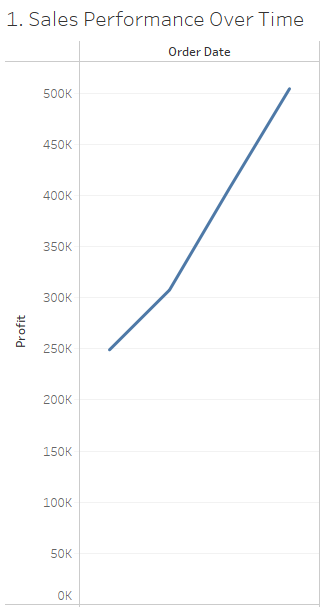
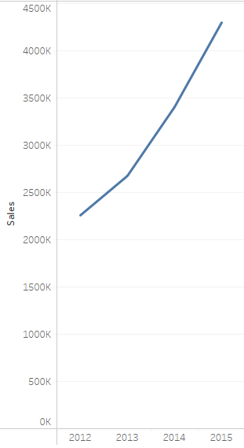
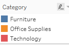
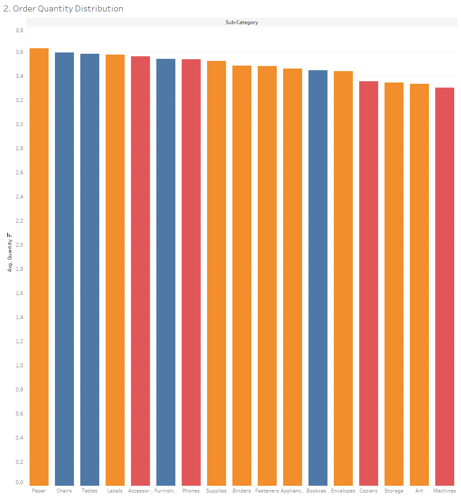
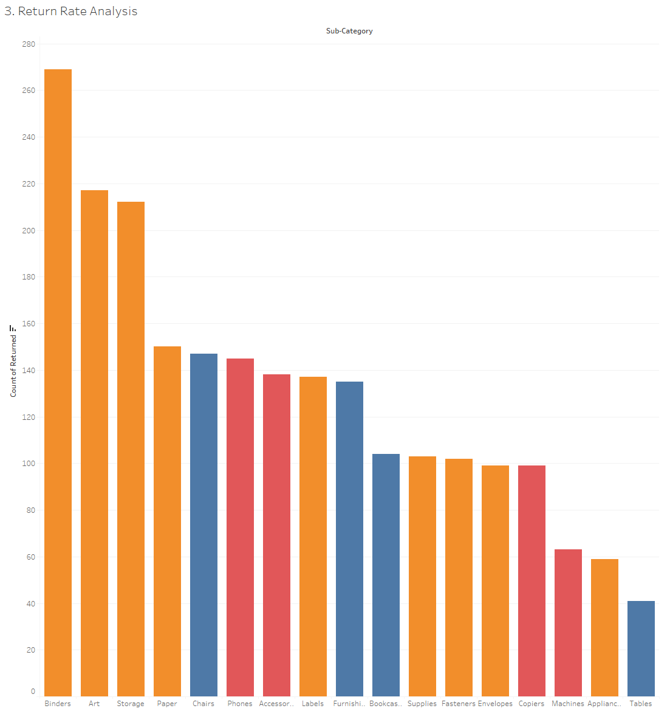
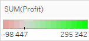
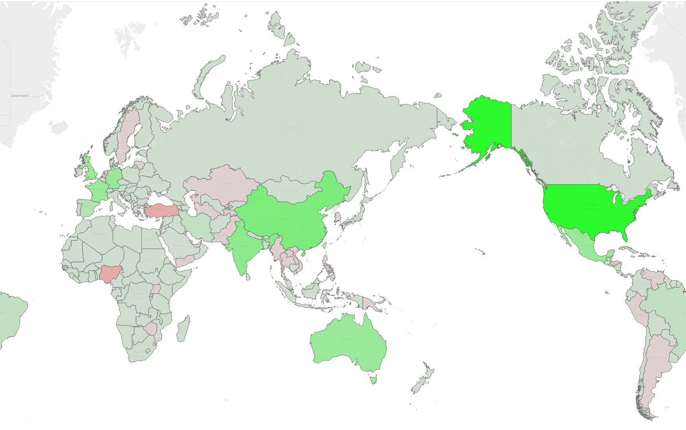
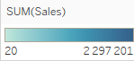
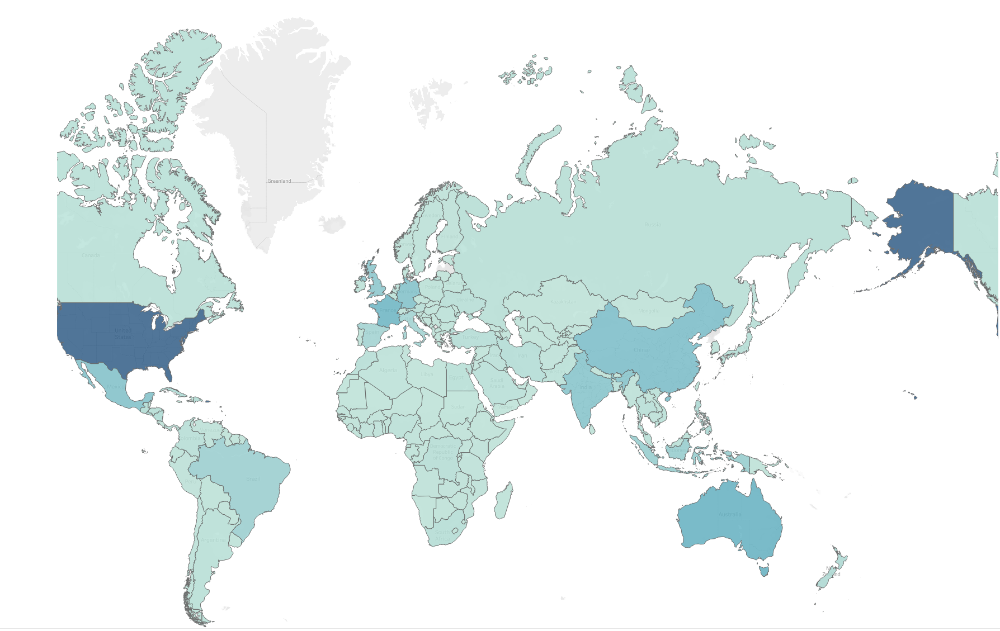
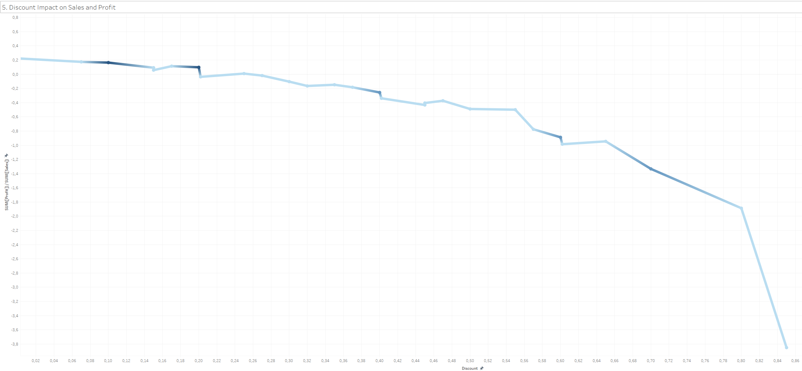

[Back to main](../README.md)

# Questions:

## 1. Sales Performance Over Time

- __Subject:__ How have the total sales and profit trends evolved over the years?
- __Visualization:__ Line charts showing sales and profit trends over time.
- __Insights to gather:__ Identify any seasonal patterns or significant changes in sales and profits.

- __Charts:__

- __Gathered insights:__
    - The total sales and profits have been increasing steadily over the years.
    - The data shows a clear upward trend in both sales and profits, indicating positive growth for the company.
    

## 2. Order Quantity Distribution

- __Subject:__ What is the distribution of order quantities across different product categories?
- __Visualization:__ Histograms plots showing the distribution of order quantities for various product categories.
- __Insights to gather:__ Identify the most common order quantities and any outliers in the data.
- __Charts:__

- __Gathered insights:__
  - The data shows that the Paper category has the highest order quantity.

## 3. Return Rate Analysis
- __Subject:__ What is the return rate for products, and which categories have the highest return rates?
- __Visualization:__ Bar chart showing returns amount by product category.
- __Insights:__ Identify the product categories with the highest return rates and explore potential reasons for returns.
- __Charts:__

- __Gathered insights:__
  - The data shows that the Binders category has the highest return rate, followed by the Art category.

## 4. Sales and Profit by Country

- __Subject:__ How do sales and profits vary across different countries within each region?
- __Visualization:__ Geographical maps or bar charts showing sales and profits by country.
- __Insights:__ Identify the top-performing regions and explore factors contributing to their success.
- __Charts:__

- __Gathered insights:__
  - The most profitable countries are the United States, China, and Australia.
  - The most unprofitable countries are the Turkey, Nigeria, and Uganda.

## 5. Discount Impact on Sales and Profit

- __Subject:__ How do different discount levels affect sales volume and profit margins?
- __Visualization:__ Scatter plots showing the relationship between discount levels, sales volume, and profit margins.
- __Insights:__ Identify the impact of discounts on sales and profits and determine the optimal discount strategy.
- __Charts:__

- __Gathered insights:__
  - The data shows that higher discounts lead to lower profit margins.
  - The best discount level for maximizing sales and profits is around 10-20%.